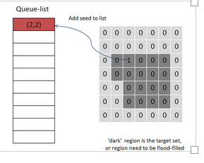
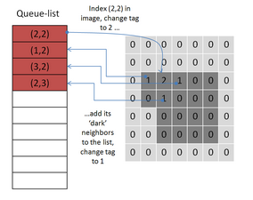

# Region Growing Algorithm

Here we implement the Region Growing algorithm and apply to extract the target area in given image.

- Region growing算法最早由Adams, R.在1994年提出（Seeded Region Growing ，IEEE Transactions on Parttern Analysis）

原理：

- 

- 

实现效果：

- 
- 
 
